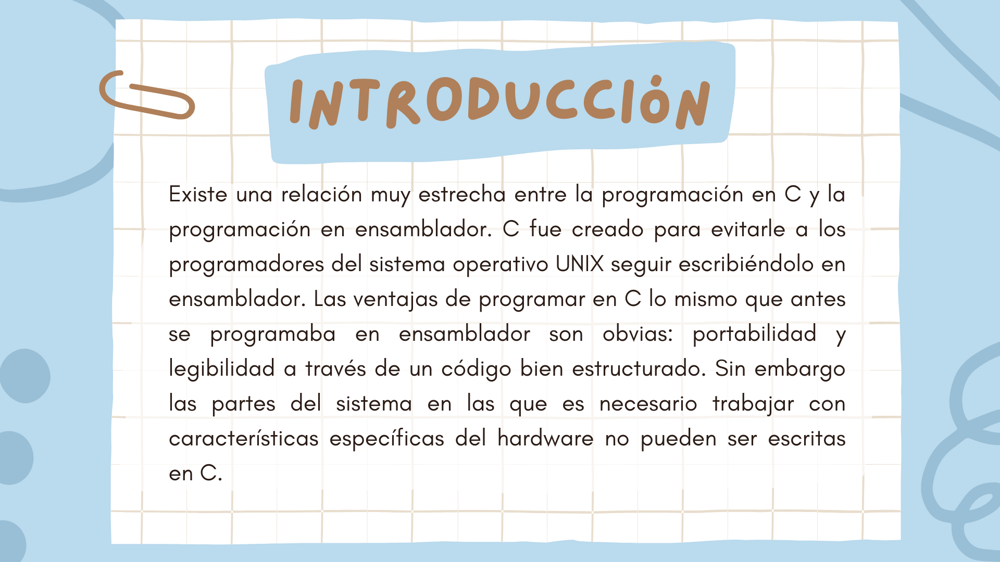
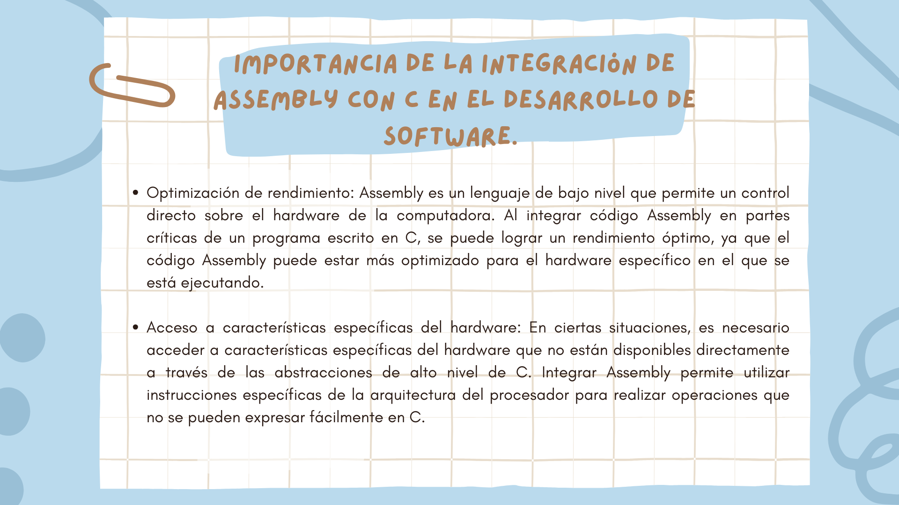
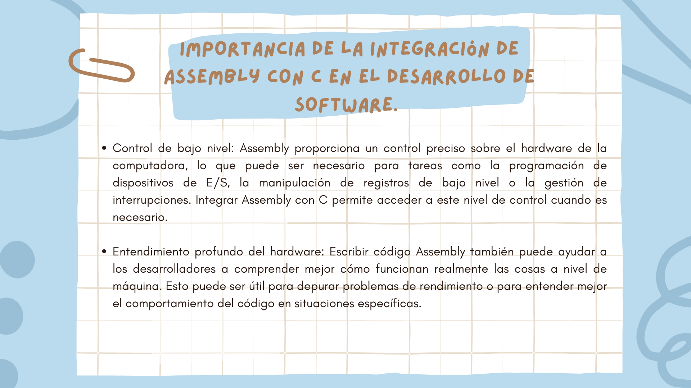
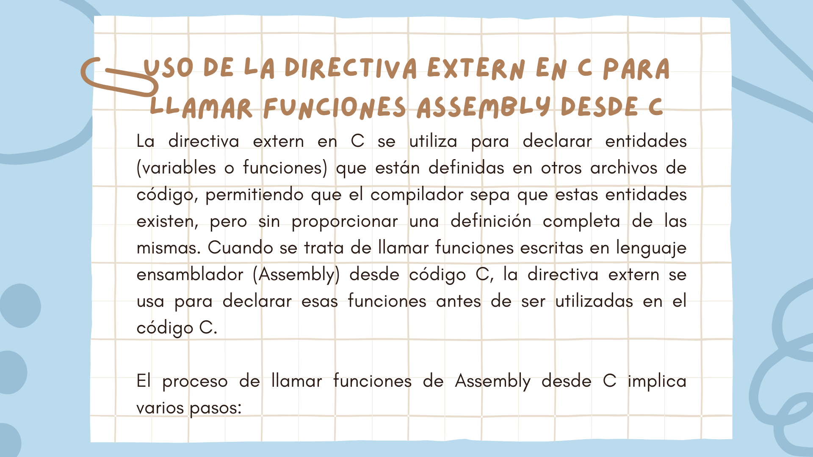

# Integración de código Assembly con C

<pre>
<p align=center>
Tecnológico Nacional de México
Instituto Tecnológico de Tijuana

Departamento de Sistemas y Computación
Ingeniería en Sistemas Computacionales

Semestre:
Febrero - Junio 2024

Materia:
Lenguajes de interfaz

Docente:
M.C. Rene Solis Reyes 

Unidad:
2

Título del trabajo:
Exposición: Integración de código Assembly con C

Estudiantes:
Morales Calvo Ángel Omar - 21212000
López Machado Oscar Roberto - 21211978
Narvaez Mata Alejandro - 22210325
</pre>

## Resumen
Repositorio que contiene la presentación sobre el tema "Integración de código Assembly con C" en el cual
se muestran y describen algunas razones por las que tiene sentido integrar Assembly dentro de código fuente
escrito en C, y de qué forma se hace dicha integración. Se muestra un ejemplo práctico de código de C enlazado
con un archivo objeto escrito en código Assembly para calcular el factorial de un número dado.

## Presentación









### Ejemplo
A continuación se presenta un programa en C para calcular un factorial dado, utilizando una función externa definida en un archivo escrito en código Assembly.

```C
#include <stdio.h>

// Declaración de la función calcularFactorial que está definida en código Assembly
extern int calcularFactorial(int n);

int main(int argc, char** argv) {
    int num; // Variable para almacenar el número ingresado por el usuario

    // Solicitar al usuario que ingrese un número
    printf("Ingresa un número: ");
    scanf("%d", &num); // Leer el número ingresado por el usuario y almacenarlo en la variable num

    // Llamar a la función calcularFactorial para calcular el factorial del número ingresado
    int factorial = calcularFactorial(num);

    // Mostrar el resultado del factorial
    printf("\nEl factorial de %d es: %d\n", num, factorial);

    return 0; // Devolver un valor indicando que el programa se ejecutó correctamente
}
```

Cómo se observa, la función `calcularFactorial` se declara por medio de `extern` el cual indica al compilador que la definición de la función (su cuerpo) se encuentra en otro lado, y que el enlace de la función se resolverá en tiempo de enlace. La función `calcularFactorial` está definida por el siguiente código de Assembly escrito para 'Armv7l', es decir, la arquitectura ARM de 32 bits.

```ASM
.global calcularFactorial    @ Declara que calcularFactorial es visible para el enlazador
.type calcularFactorial, %function   @ Especifica el tipo de calcularFactorial como una función

calcularFactorial:
        stmfd sp!, {lr}        @ Almacena el registro lr (dirección de retorno) en la pila
        mov r1, r0             @ Mueve el valor de r0 (número para calcular factorial) a r1
        mov r2, #1             @ Mueve el valor 1 a r2 (inicializa el acumulador del factorial)
        mov r3, #1             @ Mueve el valor 1 a r3 (inicializa el contador)
        bl mult                @ Llama a la función mult para calcular el factorial

mult:
        cmp r1, #0             @ Compara r1 con 0
        ble return             @ Si r1 es menor o igual a 0, salta a return
        mul r3, r2, r1         @ Multiplica r2 (acumulador) por r1 y almacena el resultado en r3
        mov r2, r3             @ Mueve el resultado de la multiplicación a r2
                               @ r2 funciona como auxiliar o sustituto de 3,
                               @ ya que no se puede tener el mismo registro en Rd y Rm: mul Rd, Rm, Rs => Rd = Rm * Rs
                               @ mul Rd, Rm, Rs => Rd = Rm * Rs, de otro modo, podríamos hacer (mov r2, r2, r1) => r2 = r2 * r1
        sub r1, r1, #1         @ Resta 1 a r1 (decrementa el contador)
        bl mult                @ Llama recursivamente a la función mult

return:
        mov r0, r3             @ Mueve el resultado del factorial (en r3) a r0 (registro de retorno)
        ldmfd sp!, {lr}        @ Carga el registro lr (dirección de retorno) desde la pila
        bx lr                  @ Salta a la dirección de retorno
```

El código en pocas palabras utiliza tres registros para el cálculo del factorial, `r0` el cual es el registro que almacena el argumento de la función, `r1` que se utiliza como contador que irá de `r0` hasta 0, `r2` el cual funciona como un acumulador secundario para el factorial, y `r3` en el que se almacena el cálculo del factorial. Un ejemplo sería el factorial de 3:

```
  Inicialización:
    r0 = 3
    r1 = 3 @ después de copiar el valor de r0 a r1
    r2 = 1
    r3 = 1

  Cálculo:
    - r1 es mayor a 0
    r3 = r2 * r1 (r3 = 1 * 3 = 3)
    - se decrementa r1 (r1 = 2)
    r2 = r3 (r2 = 3)
  
    - r1 es mayor a 0
    r3 = r2 * r1 (r3 = 3 * 2 = 6)
    - se decrementa r1 (r1 = 1)
    r2 = r3 (r2 = 6)
  
    - r1 es mayor a 0
    r3 = r2 * r1 (r3 = 6 * 1 = 6)
    - se decrementa r1 (r1 = 0)
    r2 = r3 (r2 = 6)
  
    - r1 no es mayor que 0
    r0 = r3 (r0 = 6)
    - se retorna r0
```

Para poder integrar ambos archivos, primero se ensambla el código Assembly con `as -o <nombre-objeto-a>.o <nombre-archivo-s>.s`. Luego, se compila el código de C con `gcc -o <nombre-objeto-c>.o -c <nombre-archivo-c>.c`. Finalmente, se crea el ejecutable utilizando ambos códigos objeto con `gcc -o <nombre-ejecutable> <nombre-objeto-c>.o <nombre-objeto-s>.s`. Se ejecuta con el siguiente comando: `./<nombre-ejecutable>`.

De este modo, al ejecutarse, el programa nos pedirá ingresar un número, y cuando reciba un entero, este utilizará la función `calcularFactorial` para obtener el factorial del número dado, y lo desplegará en consola.


